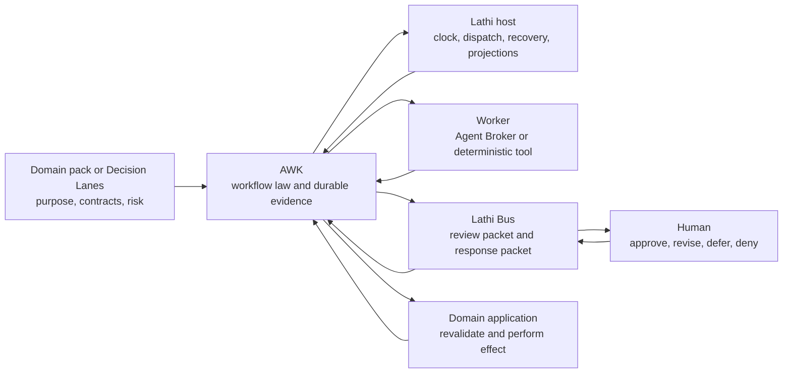

# Canonical Workflow Control Architecture and Migration Plan

Status: Implementation complete; local source/package acceptance GO
Owner: Suman Choudhary
Primary orchestrator: Codex Super Goal
Last updated: 2026-07-18
Scope: `agent-workflow-kernel`, `lathi`, `lathi-bus`, `decision-lanes-engine`, and `decision-lanes-site`

## Executive Summary

The ecosystem needs one durable workflow-law implementation and several clearly
bounded consumers. Agent Workflow Kernel (AWK) is that implementation. It owns
workflow state, stage authority, leases, retries, content-bound approvals,
receipts, recovery, and replayable provenance. It does not own domain judgment,
the runtime clock, human-surface transport, provider selection, or irreversible
domain effects.

Lathi is the host and operator core. Lathi Bus is the human interaction
protocol. Decision Lanes is a domain product that turns operations-research
questions into auditable decision artifacts. Agent Broker and deterministic
tools perform labor. Domain applications validate and perform their own
consequential effects.

The immediate migration removes Decision Lanes' copied kernel, makes it consume
the canonical AWK package through one module identity, preserves existing
ledger/workflow behavior, untracks local supervisor packets, and removes stale
or contradictory source recoverably. The longer-term refactor makes AWK smaller
and easier to evolve without forcing a risky rewrite.

## Problem

The architecture is conceptually sound but implementation ownership has drifted:

1. AWK declares itself the canonical package, but Decision Lanes packages a
   20-file, 15,464-line vendor copied from the old Lane Host lineage.
2. Decision Lanes imports that vendor both as `agent_workflow_kernel` and as
   `engine.agent_workflow_kernel`, creating two Python class identities.
3. AWK's public surface now exposes 146 names and includes testing, live-surface,
   personal-reviewer, and host-specific concerns alongside workflow law.
4. Domain workflow definitions and prompts appear in AWK even though Lathi's
   ownership contract says packs own workflow shape, prompts, persona, and risk.
5. “Gate” currently refers to validation checks, human approvals, and activation
   authority in different documents.
6. Local `.super-goal`, `.supervisor`, and `.supervisor-lane` packets have been
   tracked in Decision Lanes repositories even though they are orchestration
   scratch, not product truth.
7. A green test in one repository can hide a split package identity, stale
   entrypoint, incompatible historical ledger, or duplicated approval path.

The consequence is not only extra code. It is ambiguity about which component
may advance state and which artifact is authoritative.

## Users and Jobs

### Primary operator

Suman needs agent-driven work to progress without becoming the scheduler, while
retaining explicit authority for public, financial, auth, deployment, and other
consequential actions.

### Product and domain developers

Developers need to add or change a workflow without reimplementing leases,
retries, gates, receipts, or recovery, and without moving domain logic into a
generic framework.

### Agent workers

Agents need bounded stage inputs, explicit allowed outcomes, durable artifact
contracts, and a clear stop state: done, waiting, retrying, blocked, denied, or
cancelled.

### Maintainers

Maintainers need one canonical package, schema migration rules, stable public
entrypoints, conformance tests, and a safe way to remove compatibility code.

## User Scenarios

### Scenario 1: Resume a long-running workflow

Given a Lathi-owned workflow whose process stopped after a stage receipt, when
Lathi restarts, then canonical AWK reconstructs state from the ledger, claims
only the next legal work, and does not repeat the completed stage.

### Scenario 2: Approve a reviewed artifact

Given a content-bound gate published through Lathi Bus, when Suman selects one
valid decision, then the collected packet is validated against the exact
workflow, artifact, action fingerprint, and current state before AWK advances.

### Scenario 3: Run a Decision Lanes case

Given a business question and compatible pack, when Decision Lanes executes its
fixture lifecycle, then domain artifacts are produced by Decision Lanes while
canonical AWK alone owns stage authority, retries, gates, and receipts.

### Scenario 4: Reject stale authority

Given an approval for an older artifact or changed action, when a host tries to
apply it, then AWK rejects it, records the reason, and leaves the workflow in a
named waiting or blocked state.

### Scenario 5: Add a new domain pack

Given a new decision family or agent workflow, when its owner supplies a
definition, contracts, adapters, prompts, and fixtures, then it can run without
copying or editing AWK core.

## Product Thesis

AWK creates value only where a workflow must survive time, failure, multiple
actors, or a consequential gate. It is not valuable as a generic wrapper around
a single function call.

The one sentence to remember is:

> AWK is the constitution; Lathi is the operating government; Lathi Bus is the
> human membrane; the domain product owns meaning and effects.

## Goals

1. Establish exactly one workflow-law implementation and one Python package
   identity across the scoped repositories.
2. Preserve all supported workflows and historical ledger semantics through the
   migration.
3. Make state, labor, gates, transport, projections, and effects have explicit
   owners.
4. Reduce duplicated and tracked non-product code measurably.
5. Keep domain-specific workflows, prompts, solvers, and validation with their
   domain owners.
6. Provide an implementation and rollout plan that is independently auditable.
7. Leave live/public/auth/money/trading effects behind existing human gates.

## Non-Goals

1. Replacing Agent Broker, Lathi Bus, Memory Core, or domain applications.
2. Making AWK a no-code workflow builder, agent brain, or arbitrary distributed
   orchestration platform.
3. Migrating app-owned Bhiksha, Kamandal, or Radhe state into AWK merely for
   uniformity.
4. Deploying or restarting oldmac services as part of the source migration.
5. Breaking the current public API before consumers have a compatibility path.
6. Solving multi-host distributed consensus. SQLite remains a single-writer or
   carefully serialized local-store design until a real use case requires more.

## System Mental Model



## Ownership Model

| Component | Owns | Must not own |
|---|---|---|
| AWK | Definitions-as-executed, instances, stage runs, leases, transitions, retries, budgets, approval fingerprints, receipts, events, recovery | Domain semantics, provider choice, schedules, credentials, live surface formatting, irreversible domain effects |
| Lathi | Clock, mutation lock, due-work discovery, dispatch, external bridges, action journal, recovery policy, Control Tower/Blackboard projection | A second workflow state machine, domain validation, prompt bodies, Lathi Bus parsing |
| Lathi Bus | Publish/ask/collect/archive, surface profiles, response provenance, pickup queue state | Workflow transitions, domain decisions, durable memory, free-form agent chat |
| Decision Lanes | OR lifecycle, cases, artifacts, questions, data binding, baseline, model/solver/evaluation contracts, recommendation semantics | A copied kernel, provider routing internals, activation without signoff |
| Agent Broker | Provider/model selection, capability translation, fallback, execution receipt and usage | Workflow state, case truth, human approval, domain activation |
| Domain application | Current-state validation, domain receipt, irreversible or operational effect | Treating a surface tap or stale approval as sufficient authority |
| Decision Lanes Site | Explain the offer and trust method | Runtime truth, workflow state, gate authority |

## Source-of-Truth Rules

1. A domain pack or product owns the authored workflow definition.
2. AWK stores the exact canonical definition and hash used by each instance.
3. The AWK ledger owns workflow and stage status.
4. Domain artifacts and case stores own domain truth.
5. Lathi Bus notes are human-facing envelopes; collected packets are transport
   evidence, not workflow state.
6. Lathi projections are read models, not authority.
7. A provider transcript or session is labor evidence, not completion truth.
8. A consequential effect is complete only after the domain owner returns a
   receipt and any required readback succeeds.

## Canonical Workflow Lifecycle

```text
definition selected and hashed
  -> instance created idempotently
  -> next stage queued
  -> host claims stage under lease
  -> policy and prompt/context preflight
  -> worker or deterministic activity invoked
  -> typed result and artifacts validated
  -> receipt recorded
  -> transition guard evaluated
  -> next stage, human wait, retry, block, denial, cancellation, or terminal done
```

The model may propose an outcome. Only AWK records the authoritative transition.

## Human Gate Lifecycle

```text
AWK GateRequest
  = workflow/stage ids
  + immutable artifact hashes and workflow-definition hash
  + allowed decisions
  + exact action fingerprint
  + expiry/state constraints

Lathi host -> Lathi Bus -> human surface
human response -> Lathi Bus DecisionPacket -> Lathi host
AWK validates content, decision, fingerprint, state, and authority
AWK advances or records a fail-closed rejection
```

The fingerprint covers the workflow, instance, stage, stage-run, requested
action, target, canonical arguments, workflow-definition hash, context digest,
sorted immutable artifact hashes, allowed decisions, risk classes, hard gates,
and expiry when configured. Human-readable evidence references are provenance,
not a substitute for content hashes. A surface or caller may transport this
authority envelope but may never reconstruct it from current state during
collection.

The collected packet must return the exact authority envelope that was
published. Lathi compares the published and collected envelopes byte-for-byte
before constructing an AWK decision receipt. A changed gate ID, fingerprint,
action, definition hash, artifact hash, allowed-decision set, or expiry fails
closed. AWK independently re-derives the expected fingerprint from its ledger.

Terms are normalized as follows:

- **Validation check:** deterministic evidence check; no human authority implied.
- **Human approval gate:** a person approves a content-bound transition.
- **Activation gate:** the final authority to make a recommendation or change
  actionable in a domain.
- **Transport interaction:** a Bus publish/ask/collect lifecycle; it does not
  itself grant workflow authority.

Decision Lanes may market six trust checks while implementing five human sign
points, as long as documents use these distinct terms.

## External Effect Contract

AWK never treats “adapter call returned” as proof of a consequential effect.
The required sequence is:

1. Prepare a deterministic action request.
2. Bind approval to its fingerprint and evidence.
3. Validate approval against current workflow state.
4. Ask the domain owner to revalidate current domain state.
5. Perform the effect through the domain owner's command/API.
6. Record the domain receipt.
7. Read back the target state when practical.
8. Advance only from the recorded result.

## Target Package Architecture

The migration keeps one installable distribution first, then improves internal
cohesion without a flag-day rewrite.

```text
agent_workflow_kernel/
  contracts/       stable dataclasses, enums, commands, events
  definitions/     DSL loading, canonicalization, validation
  control/         transition reducer, guards, policy, approvals
  runtime/         runner, leases, retries, recovery, sessions
  storage/         SQLite repository and explicit schema migrations
  ports/           minimal activity and gate interfaces
  provenance/      prompts, context hashes, artifacts, receipts

agent_workflow_kernel_testing/
  in-memory/fake activities, sandbox surfaces, conformance fixtures

agent_workflow_kernel_{host-or-domain}/
  OpenClaw, Codex, Lathi Bus, Ivy/Jonah, X Digest, and other integrations
```

This is a target boundary, not permission to move every file immediately. A
move is accepted only when it reduces coupling and existing imports have a
tested compatibility path.

## Public API Policy

1. Consumers import from `agent_workflow_kernel`, never internal submodules.
2. The migration identifies the smallest real consumer surface and documents it.
3. Existing exports remain behind deprecation aliases until all known consumers
   migrate and at least one release boundary passes.
4. New personal, host, surface, or domain-specific names cannot enter the core
   public API.
5. Private helpers used by a consumer must either become deliberate public
   contracts or move into the consumer; copying the helper is not allowed.
6. Public API compatibility is guarded by tests and a machine-readable manifest.

## Storage and Migration Policy

1. `PRAGMA user_version` is the authoritative physical-schema version. The
   migration release supports exactly version 0 (the inspected AWK 0.3.x and
   Decision Lanes vendor layout) and version 1 (the first explicitly versioned
   canonical layout). Broader historical support requires another evidenced
   migration, not a guess.
2. A new database is created atomically at version 1. A version-0 database is
   first structurally classified against the supported legacy signature, then
   migrated 0 -> 1 in one transaction. Reopening version 1 is idempotent.
3. A malformed version-0 database or an unsupported future version fails before
   any schema or row mutation. Initialization cannot leave a partially created
   canonical schema after failure.
4. Workflow definitions, input snapshots, stage attempts, approvals, receipts,
   artifacts, and events retain row identity, hashes, status, and order across
   migration.
5. Fixtures cover empty, queued, claimed, started, waiting-human, approved,
   retrying, blocked, and terminal ledgers. They prove second-open idempotency,
   no duplicate work/evidence, future-version no-mutation, and malformed-schema
   no-mutation.
6. Runtime migration is copy-first: quiesce the writer, create and hash a backup,
   migrate a copy, run SQLite integrity and semantic comparisons, then atomically
   select the migrated database. Rollback restores the byte-for-byte backup;
   the old vendor is not assumed to understand version 1.
7. Source migration does not authorize a live database migration. Oldmac backup,
   deploy, swap, and readback remain a separate protected gate.

## Lease Validity Contract

Every mutation that completes, retries, blocks, or otherwise resolves claimed
work must atomically verify the expected run status, lease owner, lease token,
and `lease_expires_at > mutation_time`. A correct token does not survive its
expiry. The same timestamp used for validation is recorded on the mutation.
Expired completion, wrong-owner completion, swept-then-complete, and boundary-
time races are required negative tests.

## Repository Strategy

### Agent Workflow Kernel

- Remains the sole source of workflow law.
- Keeps neutral conformance workflows, not the canonical domain catalog.
- Publishes dependency, API, schema, and migration policy.
- Hosts cross-consumer compatibility fixtures where they test generic law.

### Lathi

- Continues to depend on canonical AWK.
- Keeps its runner wrapper thin.
- Maps pack demand and host adapters into AWK.
- Does not absorb Lathi Bus parsing or external-app domain validation.

### Lathi Bus

- Remains dependency-light and usable without AWK.
- Publishes typed transport packets with an optional, opaque, versioned
  `authority_context`; it does not import AWK or interpret that context.
- Maintains one canonical collector/pickup queue.
- Provides an integration adapter outside AWK core.
- Derives pickup identity from the collected packet's immutable content/version,
  not only its path. A corrected decision becomes a new pending packet.
- Rejects acknowledgement of unknown packet IDs and preserves a foreign-key or
  equivalent existence invariant between packets and consumption rows.

### Decision Lanes Engine

- Declares a versioned AWK dependency. Local source acceptance resolves internal
  packages from a hashed wheelhouse built from exact candidate SHAs; deployment
  uses an immutable remote Git pin or package index only after a separate
  publish gate.
- Removes `engine/agent_workflow_kernel` from the wheel and source tree.
- Imports all kernel contracts from the top-level canonical package.
- Owns case, OR, model, pack, artifact, solver, and recommendation semantics.
- Moves any retained conductor/proof code under `decision_lanes`; the generic
  top-level `engine` package is not shipped. Legacy code remains only where it
  provides unique compatibility evidence; otherwise it is removed in Git.

### Decision Lanes Site

- Tracks no Super Goal/supervisor packets.
- Uses stable product language from this architecture.
- Continues as a static marketing site without runtime coupling.

## Dependencies

- Python 3.11 or newer and SQLite for the current canonical local runtime.
- PyYAML for authored workflow definitions.
- A candidate wheelhouse containing AWK and every non-index internal dependency,
  built from exact Git SHAs with recorded SHA-256 hashes. Consumer dependency
  metadata remains normal version constraints so the wheels resolve from that
  wheelhouse without editable paths or `PYTHONPATH` help.
- Lathi Bus only for workflows that require its human interaction surfaces.
- Agent Broker only for provider-backed labor stages.
- Pack-scoped solver dependencies for Decision Lanes; unrelated packs must
  remain importable when those optional dependencies are absent.
- Git history or an explicit external archive for every pruned artifact.

## Package and Release Identity

The source-complete migration produces a local candidate release manifest with:

- repository, distribution name/version, exact candidate Git SHA, and dirty
  status for AWK and each consumer;
- wheel filename and SHA-256, Python version, and exact top-level package
  allowlist;
- lockfile hash and resolved internal dependency versions/SHAs;
- `importlib.metadata` readback from clean installed wheels; and
- the AWK distribution version and source identity recorded in Decision Lanes
  case/migration evidence.

The migration release increments AWK's minor version because schema, authority,
and lease enforcement change. README, dependency policy, package metadata,
runtime version readback, and consumer constraints must agree. A Git tag or
remote source pin is a publish action and is not claimed until separately
authorized; local acceptance uses the hashed candidate wheelhouse.

Clean-install proof runs outside all checkouts with `PYTHONPATH` empty. It
installs dependencies (never `--no-deps`), runs `pip check`, imports the exact
promised package allowlist, and executes representative workflows. AWK's
allowlist includes every maintained adapter distribution, including X Digest.
Decision Lanes' wheel allowlist is only `decision_lanes` plus distribution
metadata—neither `engine` nor any copied `agent_workflow_kernel` package.

## Import Boundary Enforcement

Known consumers and separately distributed AWK adapters import contracts only
from top-level `agent_workflow_kernel`. An AST-based check rejects
`agent_workflow_kernel.SUBMODULE` imports in Decision Lanes, Lathi, and AWK
adapter distributions. Deliberate shared contracts are promoted to the public
manifest; generic conveniences such as timestamps and YAML parsing remain local
to consumers. Compatibility aliases inside the AWK distribution are temporary,
versioned, and excluded from new consumer code.

## Requirements

### Functional Requirements

| ID | Requirement |
|---|---|
| FR-1 | A workflow instance is created idempotently from an immutable definition and input hash. |
| FR-2 | Only the canonical AWK package may authoritatively advance a scoped workflow. |
| FR-3 | Stage work is claimed under a lease and cannot be completed with a stale or foreign lease token. |
| FR-4 | Retries, budgets, stale work, child sessions, cancellation, denial, blocking, and recovery remain durable. |
| FR-5 | Human approval is content-bound and fails closed on changed definition, artifact, action, expiry, or state. |
| FR-6 | Every official transition records actor, inputs, outputs, receipts, hashes, and failure classification. |
| FR-7 | Lathi can resume adopted workflows after process restart without provider-session memory. |
| FR-8 | Lathi Bus can publish and collect independently while AWK owns decision interpretation. |
| FR-9 | Decision Lanes can create, resume, audit, and export a case through canonical AWK. |
| FR-10 | Historical Decision Lanes ledgers supported by the migration resume without duplicate official evidence. |
| FR-11 | Domain effects require domain validation and receipts after any AWK approval. |
| FR-12 | A third-party/domain workflow can be added without editing AWK core. |
| FR-13 | Control packets under `.super-goal`, `.supervisor`, and `.supervisor-lane` remain local and untracked. |
| FR-14 | Removed source is recoverable through Git history or a timestamped external archive manifest. |
| FR-15 | An expired, foreign-owner, wrong-status, or swept lease cannot authorize a transition; a late external result enters reconciliation/unknown-effect handling. |
| FR-16 | A corrected Bus decision is a new consumable packet revision and an unknown packet cannot be acknowledged. |
| FR-17 | Unknown, future, or malformed ledger schemas are rejected before mutation; supported version-0 ledgers migrate atomically to version 1. |
| FR-18 | Gate publication and collection preserve one versioned authority envelope; neither Lathi nor a worker may substitute current-query authority. |

### Nonfunctional Requirements

| ID | Requirement |
|---|---|
| NFR-1 | Core tests run without provider credentials, network, oldmac, or live surfaces. |
| NFR-2 | Canonical package identity is asserted in consumer conformance tests. |
| NFR-3 | SQLite schema migration and resume tests are deterministic. |
| NFR-4 | Public API and dependency changes are versioned and reviewable. |
| NFR-5 | No secrets, raw client data, auth state, or live tokens enter fixtures or receipts. |
| NFR-6 | Failure messages name the failed stage, classification, evidence path, and next repair action. |
| NFR-7 | Source, fixture-shadow, live-readonly, dual-run, and owned-execution claims remain distinct. |
| NFR-8 | The migration measurably reduces tracked source and duplicated implementation lines. |
| NFR-9 | Full repository verification can be run from documented commands. |
| NFR-10 | No worker or provider can approve its own protected human gate. |
| NFR-11 | Candidate wheels install with dependencies in empty environments outside all checkouts and pass `pip check`. |
| NFR-12 | A release manifest binds distribution versions, candidate Git SHAs, lock hashes, wheel hashes, import origins, and package allowlists. |

## Edge Cases and Failure States

| Case | Required behavior |
|---|---|
| Same vendored database opened by canonical AWK | Migrate or reject with a precise supported-version error; never partially advance. |
| Same module loaded under two names | Conformance test fails; Decision Lanes uses only the canonical top-level package. |
| Approval collected after artifact changes | Reject and republish a new gate bound to the new hash. |
| Caller substitutes current gate fields during collection | Reject; only the authority envelope returned by the collected packet is admissible. |
| Corrected decision after pickup ACK | Create a new content-addressed revision that is pending for every consumer. |
| ACK arrives before packet harvest | Reject the unknown packet ID; it cannot suppress a future harvest. |
| Adapter succeeds but receipt persistence fails | Do not blindly repeat an unknown external effect; record unknown-effect recovery state. |
| Result arrives after lease expiry | Do not complete the stage; record a non-authoritative late-result/reconciliation receipt. |
| Worker dies with a lease | Recover after lease policy; preserve attempt history and idempotency key. |
| Human selects zero or multiple exclusive decisions | Bus reports ambiguity; kernel remains waiting or blocks explicitly. |
| Domain app rejects approved action as stale | Record domain rejection; do not reinterpret it as success. |
| Optional solver/provider missing | Registry/doctor marks the pack unavailable without breaking unrelated imports. |
| Old control packet remains tracked | Release check fails until the index is clean while local packet stays preserved. |
| Docs reference removed vendor paths | Documentation link/reference scan fails. |

## Rollout And Migration

The rollout is additive until canonical AWK proves behavioral parity. No
consumer loses its old path before the replacement passes its acceptance gate.
Evidence is captured per phase; assumptions that cannot yet be proven remain
explicit rather than silently becoming requirements.

### Phased Implementation Plan

### Phase 1 — Control-state hygiene

- Add root-anchored ignore rules for all three control packet names in every
  scoped repository.
- Remove previously tracked packets from Git's index without deleting local
  files.
- Capture repository SHAs, dirty paths, tests, vendor size, and dependency state.
- Preserve concurrent Decision Lanes work before any migration branch changes.

Exit proof: ignored-path readback and no tracked control packet path.

### Phase 2 — Design convergence

- Publish this architecture.
- Run a Sol evaluator that attempts to disprove ownership, migration safety,
  package strategy, and acceptance criteria.
- Record the initial NO-GO and close its six finding groups in the plan: lease
  authority, gate content/provenance binding, atomic schema migration, pickup
  revision safety, clean packaging identity, and top-level import boundaries.
- Rerun the evaluator against the amended architecture before implementation
  fanout.

Exit proof: evaluator GO or conditional GO with every condition closed.

### Phase 3 — Canonical-package migration support

- Inventory every Decision Lanes vendor import and map it to canonical public API.
- Add only the deliberate public contracts needed for migration.
- Enforce lease owner/status/token/expiry at every authoritative mutation and
  route late results to reconciliation/unknown-effect evidence.
- Introduce explicit ledger version 1, frozen version-0 shape validation, atomic
  0 -> 1 migration, future/malformed no-mutation behavior, and copy/restore
  fixtures.
- Bind gate fingerprints to definition, workflow/run identity, allowed choices,
  context, and immutable artifact hashes.
- Add package-identity, clean-wheel, ledger-upgrade, resume, and no-duplicate
  conformance tests.
- Align AWK version metadata/docs and produce the candidate release manifest.
- Improve internal boundaries opportunistically while preserving compatibility.

Exit proof: AWK full suite, stale-lease negatives, gate-tamper negatives,
migration matrix, and clean installed-wheel allowlist pass.

### Phase 4 — Decision Lanes unvendor

- Add the canonical AWK dependency and resolve it from the hashed candidate
  wheelhouse for local acceptance.
- Replace both vendor import styles with top-level canonical imports.
- Move retained `engine` code under `decision_lanes`, remove the generic wheel
  package, and delete the vendored kernel recoverably.
- Update lockfile, docs, recipes, tests, and examples.
- Prove case create/resume/audit/export and the logistics fixture lifecycle.

Exit proof: vendor and generic `engine` packages absent, one public module
identity, exact installed-wheel allowlist, Decision Lanes full suite, and
end-to-end fixture green.

### Phase 5 — Host and bus conformance

- Verify Lathi's runner, ledger, registry, Ivy/Jonah, prompt, surface, and Control
  Tower tests against the canonical version.
- Verify Lathi Bus packet and collector contracts independently.
- Add versioned authority context to publish/collect packets without an AWK
  dependency.
- Make pickup revisions content-addressed and reject unknown ACKs.
- Add a cross-boundary GateRequest -> DecisionPacket -> AWK transition test plus
  artifact change, query substitution, stale state, expiry, replay, ambiguity,
  correction-after-ACK, ACK-before-harvest, and worker-self-approval negatives.
- Remove contradictory ownership language and normalize gate vocabulary.

Exit proof: Lathi and Lathi Bus full suites plus integration contract pass.

### Phase 6 — Prune and simplify

- Remove or archive obsolete recipes, imports, compatibility helpers, and copied
  workflow-law code after reference scans.
- Move only clearly misplaced host/testing/domain code; defer speculative package
  surgery that does not reduce current maintenance cost.
- Record before/after file and line counts and recovery instructions.

Exit proof: no stale references, recoverability manifest/history, smaller tracked
surface, and full regression suites green.

### Phase 7 — Independent proof and handoff

- Run a clean cross-repository verification matrix.
- Run an adversarial evaluator against the final working trees.
- Resolve critical/high findings and bounded medium findings.
- Record source-tested versus runtime-unverified truth.
- Capture reusable repo-local lessons and propose the next goal without silently
  expanding scope.

Exit proof: acceptance audit, evaluator verdict, exact commands/results, and
complete working-tree classification.

## Verification Matrix

| Surface | Required proof |
|---|---|
| AWK | full tests; lease negatives; import/public API guards; v0/v1/future/malformed migration matrix; clean-archive wheel install; exact adapter allowlist |
| Decision Lanes | lock check; full tests; clean wheelhouse install with deps and `pip check`; pack doctor; logistics E2E; vendor/generic-engine absence; import origin and class identity |
| Lathi | dependency/version readback; full tests; registry and runner conformance; adopted workflow fixtures; top-level AWK import lint |
| Lathi Bus | full tests; profile/config tests; authority-envelope round trip; content-addressed correction and unknown-ACK negatives |
| Decision Lanes Site | clean archive `npm ci --no-audit --no-fund && npm run build`; content terminology scan; no tracked control packets |
| Cross-repo | real AWK -> Lathi -> Bus -> Lathi -> AWK gate round trip and tamper matrix; ledger resume; committed-tree/import/docs/lock/wheel stale scans; before/after size receipt |

## Success Metrics

| Metric | Baseline | Target |
|---|---:|---:|
| Workflow-law implementations | 2 canonicalized lineages | 1 |
| Decision Lanes vendored kernel | 20 files / 15,464 lines | 0 |
| Tracked Super Goal/supervisor files in scoped Decision repos | 45 | 0 |
| Python module identities for AWK in Decision Lanes | 2 | 1 |
| Known consumers using canonical dependency | Lathi; Decision Lanes copied | Lathi and Decision Lanes |
| Unresolved critical/high evaluator findings | 6 groups in initial NO-GO | 0 |
| Existing scoped repository tests | current green baselines | no regressions |

## Rollback and Recovery

- Each repository changes on a scoped branch/commit and can be reverted without
  resetting unrelated work.
- Removed tracked source remains in Git history. Nontracked/runtime artifacts are
  moved to a timestamped external archive with `MANIFEST.md` and `manifest.json`.
- Decision Lanes retains pre-migration ledger fixtures and can compare canonical
  behavior against the frozen vendor baseline during the migration.
- Database rollback is backup restoration: hash the quiesced pre-migration DB,
  migrate and verify a copy, and retain the original until live acceptance.
- Dependency pins are explicit. Rolling back means restoring the prior pin and
  vendor only through a deliberate revert, not silently copying files again.
- No oldmac deploy occurs until source proof is complete and a separate runtime
  gate is approved.

## Risks

| Risk | Impact | Mitigation |
|---|---|---|
| Private vendor behavior is missing from canonical AWK | Decision Lanes regression | Inventory imports, canonical API superset check, golden ledger/workflow fixtures |
| Concurrent dirty work is overwritten | Lost user/agent work | Per-repo ownership, worktrees where practical, status checks before every merge |
| Refactor grows into framework rewrite | Delay and new defects | Prioritize unvendoring and contract enforcement; require evidence for every move |
| Tests pass while packaging fails | Broken clean install | Build/install from an archive or isolated environment and inspect wheel contents |
| Human-surface approval diverges from kernel state | Unsafe transition | One content-bound gate contract and fail-closed state/hash validation |
| External effect retries duplicate an action | Consequential double effect | Idempotency keys, unknown-effect state, domain readback before retry |
| Expired worker result advances state | Split-brain transition | Atomic owner/status/token/expiry validation and late-result reconciliation |
| Corrected decision is hidden by prior ACK | Human intent loss | Content-addressed packet revisions and packet-existence enforcement |
| Ledger migration partially mutates unknown DB | Unrecoverable state | Frozen legacy signature, no-mutation rejection, transactional copy migration, hashed backup |
| Marketing and implementation gate counts diverge | Trust/confusion | Normalize terms while allowing six checks and five sign points |

## Open Questions

| Question | Owner | Impact | Next action |
|---|---|---|---|
| Should AWK's internal target folders become separately published distributions? | AWK maintainer | Packaging and release overhead | Decide only after unvendoring metrics show a concrete benefit. |
| Which additional historical ledger shapes merit support after v0? | AWK and consumer maintainers | Future migration scope | Add only from an inspected real fixture with its own migration and rollback proof. |
| Which domain workflow fixtures remain in AWK as neutral conformance examples? | AWK and Lathi Packs maintainers | Ownership clarity | Classify every current workflow as neutral fixture or domain-owned source. |
| When should the canonical dependency move from Git pin to package registry? | AWK maintainer | Clean-install reliability | Establish release automation and at least two consumer upgrade proofs. |
| Is a live oldmac migration needed immediately after source completion? | Suman | Deployment risk | Treat as a separate protected goal after source acceptance. |

**Assumption:** current source migration can be completed and validated
without mutating oldmac. If live readback later contradicts source behavior,
the runtime migration plan must change rather than forcing source assumptions.

## Independent Design Review Disposition

The first Sol ultra review returned **NO-GO**. It reproduced six release-blocking
finding groups even though all baseline suites were green:

The durable disposition ledger is
`docs/CANONICAL_WORKFLOW_CONTROL_FINDINGS.md`; implementation and final-review
receipts update that ledger rather than replacing the original findings.

| Finding | Design disposition | Required implementation evidence |
|---|---|---|
| Expired lease completed successfully | Closed in design by the Lease Validity Contract | stale/foreign/wrong-status/boundary tests and late-result reconciliation |
| Bus approval authority was caller-substitutable and not artifact-bound | Closed in design by one versioned, content-bound authority envelope | real round trip plus artifact/query/state/expiry/replay/self-approval negatives |
| Future/malformed SQLite DBs were partially mutated | Closed in design by the explicit v0 -> v1 matrix and preflight/no-mutation rules | fixture matrix, integrity/hash comparisons, second-open and backup restore |
| Corrected decisions remained consumed; unknown ACKs succeeded | Closed in design by content-addressed revisions and packet-existence invariant | correction-after-ACK and ACK-before-harvest negatives |
| Source tests hid a missing X Digest wheel; dependency pins were not wheel-resolving | Closed in design by the hashed candidate wheelhouse and exact allowlists | clean archive installs with deps, `pip check`, import metadata/origin, wheel hashes |
| Consumers and adapters used private AWK submodules; release identities diverged | Closed in design by AST boundary enforcement and the release manifest | zero forbidden imports and aligned version/SHA/lock/wheel provenance |

“Closed in design” means the required contract is now unambiguous. It does not
mean the defect is fixed; each row remains release-blocking until its evidence
passes and the final evaluator accepts it.

## Decisions and Options Considered

### Selected: canonical package plus bounded consumers

This preserves tested workflow law, removes duplication, and keeps domain
meaning outside the kernel.

### Rejected: rewrite AWK from scratch now

The existing tests encode hard-won lease, retry, gate, recovery, and provenance
behavior. A rewrite would spend risk without first capturing the primary value:
one canonical implementation.

### Rejected: leave the Decision Lanes vendor frozen forever

The copy already diverges, violates package policy, creates duplicate module
identities, and makes fixes non-propagating.

### Deferred: immediate multi-package physical split

The target boundary is accepted, but physical distribution splits occur only
where current consumers and tests prove lower coordination cost.

### Rejected: route every external app through AWK

App-owned systems already own domain state and effects. AWK is appropriate only
when it adds durable workflow authority rather than duplicating it.

## Acceptance Criteria

1. A versioned finding ledger records the initial design NO-GO, exact
   disposition of every finding, and an independent amended-design verdict with
   no unresolved critical/high ambiguity.
2. Candidate committed trees—not only staged indexes—ignore `.super-goal`,
   `.supervisor`, and `.supervisor-lane`, and `git ls-tree` or clean-clone scans
   find no tracked control packet.
3. Decision Lanes declares and locks canonical AWK at the candidate identity and
   contains no vendored `agent_workflow_kernel` source or generic top-level
   `engine` wheel package.
4. Installed Decision Lanes and Lathi resolve AWK from the candidate artifact;
   import-origin/class-identity checks pass and AST scans find no consumer or
   official-adapter submodule/private AWK imports.
5. Every supported version-0 fixture and representative workflow state migrates
   to version 1 and resumes without duplicate rows, hashes, events, stages,
   gates, receipts, or artifacts; reopening is idempotent, while future and
   malformed schemas fail without mutation.
6. AWK, Lathi, Lathi Bus, and Decision Lanes full suites pass together with the
   stale-lease, gate-tamper, pickup-revision, unknown-ACK, and migration negative
   suites reproduced by the evaluator.
7. Clean archives of AWK and Decision Lanes build wheels and install with all
   dependencies from the hashed candidate wheelhouse into empty environments
   outside the checkouts with empty `PYTHONPATH`; `pip check`, metadata/origin
   readback, exact package allowlists, and representative execution pass.
8. The Decision Lanes fixture lifecycle produces the expected ordered stage
   trace, readiness state, terminal or named human-gated state, receipt set, and
   artifact hashes for create/resume/audit/export and logistics paths.
9. A real AWK -> Lathi -> Lathi Bus -> Lathi -> AWK gate round trip passes, and
   artifact/query/state/expiry/provenance/replay/ambiguity/correction/self-
   approval tampering fails closed.
10. Candidate-tree and built-wheel scans across source, dynamic imports, docs,
    workflows, and locks find no live dependency on removed vendor paths or
    forbidden private boundaries.
11. Removed source is recoverable from candidate Git history; ledger recovery is
    separately proven by hashed backup, copy migration, integrity/semantic
    comparison, and byte-for-byte restore. Before/after tracked files, lines,
    package names, APIs, and dependency edges prove real maintenance reduction.
12. Decision Lanes Site passes clean-archive `npm ci --no-audit --no-fund` and
    `npm run build`, terminology checks, and candidate-tree control-path scans.
13. The candidate release manifest binds distribution versions, candidate Git
    SHAs, lock hashes/resolution, wheel hashes, package allowlists, and installed
    metadata readback.
14. A final independent evaluator finds no unresolved critical/high issue and
    every finding-ledger row is Proven, explicitly Accepted Risk, or Blocked.
15. Final receipts name each candidate SHA and dirty state, exact commands and
    results, artifacts/hashes, source-tested truth, and the explicit statement
    that oldmac/runtime was not verified or deployed.

## Completion Audit

| Requirement or claim | Evidence required | Status at plan publication |
|---|---|---|
| One canonical implementation | Dependency/import readback and vendor absence | Proven in candidate commits and clean wheels |
| Existing workflows preserved | Full suites plus cross-repo fixture matrix | Proven: AWK 285 plus 158 subtests; Lathi 386; Bus 174; Decision 96; Site clean build |
| Ledger compatibility | Frozen vendor ledger resumed by canonical AWK | Proven by v0 fixture migration, reopen, rejection, backup, and restore tests |
| Human gate safety preserved | Content/state/fingerprint positive and negative tests | Proven by the integrated five-hop round trip and fail-closed negatives |
| Codebase reduced | Before/after tracked file and line counts | Proven: from the recorded baseline, Decision removes 18,562 lines; vendored kernel accounts for 15,464 |
| Control packets local-only | Ignore and tracked-file scans | Proven in all five candidate committed trees |
| Independent design quality | Sol evaluator receipt and finding disposition | Proven: amended-design GO with no remaining blocker |
| Independent implementation quality | Final adversarial evaluator receipt | Proven: Sol final GO, no unresolved critical/high defect |

Each open row must become Proven, explicitly Accepted Risk, or Blocked with an
exact reason before the Super Goal can complete.

## Current Scope Boundary

This plan authorizes local source edits, tests, dependency lock changes, tracked
source removal recoverable in Git, and external archival of nontracked debris.
It does not authorize oldmac deploys/restarts, live operator-surface writes,
public sends, auth changes, secrets access, money movement, or trading actions.
